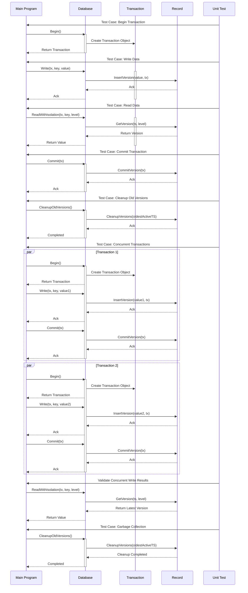

# MVCC 實現

## 序列圖

```mermaid
sequenceDiagram
participant Main as Main Program
participant DB as Database
participant Tx as Transaction
participant Rec as Record
participant Test as Unit Test

Test ->> Main: Test Case: Begin Transaction
Main ->> DB: Begin()
activate DB
DB ->> Tx: Create Transaction Object
DB -->> Main: Return Transaction
deactivate DB

Test ->> Main: Test Case: Write Data
Main ->> DB: Write(tx, key, value)
activate Tx
DB ->> Rec: InsertVersion(value, tx)
Rec -->> DB: Ack
DB -->> Main: Ack
deactivate Tx

Test ->> Main: Test Case: Read Data
Main ->> DB: ReadWithIsolation(tx, key, level)
activate Tx
DB ->> Rec: GetVersion(ts, level)
Rec -->> DB: Return Version
DB -->> Main: Return Value
deactivate Tx

Test ->> Main: Test Case: Commit Transaction
Main ->> DB: Commit(tx)
activate DB
DB ->> Rec: CommitVersion(tx)
Rec -->> DB: Ack
DB -->> Main: Ack
deactivate DB

Test ->> Main: Test Case: Cleanup Old Versions
Main ->> DB: CleanupOldVersions()
activate DB
DB ->> Rec: CleanupVersions(oldestActiveTS)
Rec -->> DB: Ack
DB -->> Main: Completed
deactivate DB

Test ->> Main: Test Case: Concurrent Transactions
par Transaction 1
    Main ->> DB: Begin()
    activate DB
    DB ->> Tx: Create Transaction Object
    DB -->> Main: Return Transaction
    Main ->> DB: Write(tx, key, value1)
    DB ->> Rec: InsertVersion(value1, tx)
    Rec -->> DB: Ack
    DB -->> Main: Ack
    Main ->> DB: Commit(tx)
    DB ->> Rec: CommitVersion(tx)
    Rec -->> DB: Ack
    DB -->> Main: Ack
    deactivate DB
end
par Transaction 2
    Main ->> DB: Begin()
    activate DB
    DB ->> Tx: Create Transaction Object
    DB -->> Main: Return Transaction
    Main ->> DB: Write(tx, key, value2)
    DB ->> Rec: InsertVersion(value2, tx)
    Rec -->> DB: Ack
    DB -->> Main: Ack
    Main ->> DB: Commit(tx)
    DB ->> Rec: CommitVersion(tx)
    Rec -->> DB: Ack
    DB -->> Main: Ack
    deactivate DB
end

Test ->> Main: Validate Concurrent Write Results
Main ->> DB: ReadWithIsolation(tx, key, level)
DB ->> Rec: GetVersion(ts, level)
Rec -->> DB: Return Latest Version
DB -->> Main: Return Value

Test ->> Main: Test Case: Garbage Collection
Main ->> DB: CleanupOldVersions()
activate DB
DB ->> Rec: CleanupVersions(oldestActiveTS)
Rec -->> DB: Cleanup Completed
DB -->> Main: Completed
deactivate DB

```
